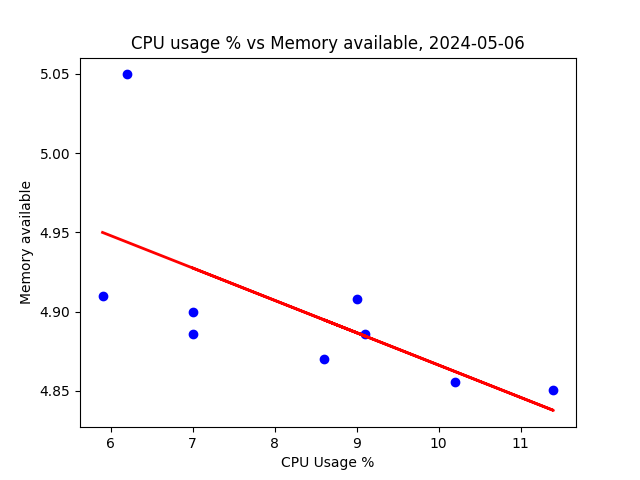
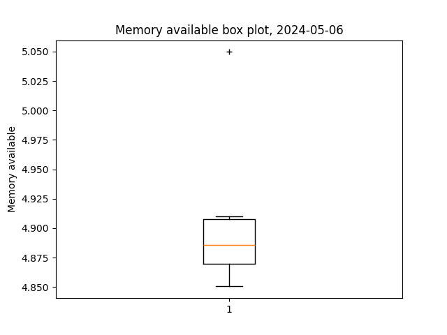
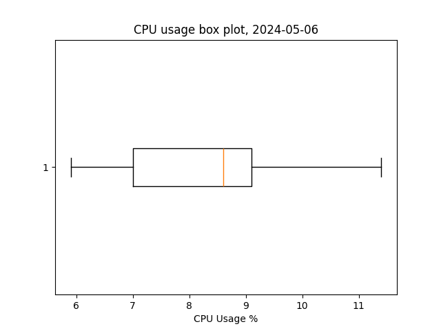
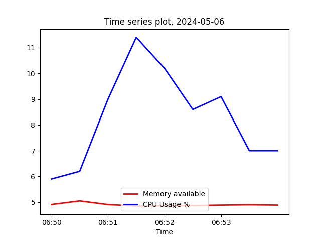
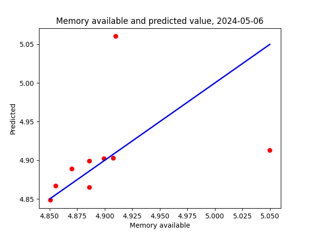

# CPE 322 Lab 8

## Note
- I had to change Temperature C to Memory available in plt_final and plt_cv2 because the cpu data collection (for non Raspberry Pi computers) doesn't collect temperature info

## Images

