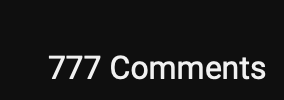

# CPE-322-Repo
(Academic work only) Repository for academic work relating to the CPE 322 course

**Test of bold text here**

*Test of italicized text*

> UEFI/EDK2 or as I like to call it - protocol hell

1. make a team for senior design
2. commit to a project
3. do stuff
4. profit

- pcie is hard to deal with
- UEFI is one of the worst firmware designs in history
- why did anyone accept UEFI/EDK2

`return true`

## Lab Checklist

- [x] Lab 1
- [x] Lab 2
- [x] Lab 3
- [ ] Lab 4
- [x] Lab 5
- [x] Lab 6
- [x] Lab 7
- [x] Lab 8
- [x] Lab 9
- [x] Lab 10

---

[EDK2 FDF file specification](https://tianocore-docs.github.io/edk2-FdfSpecification/release-1.28.01/)

